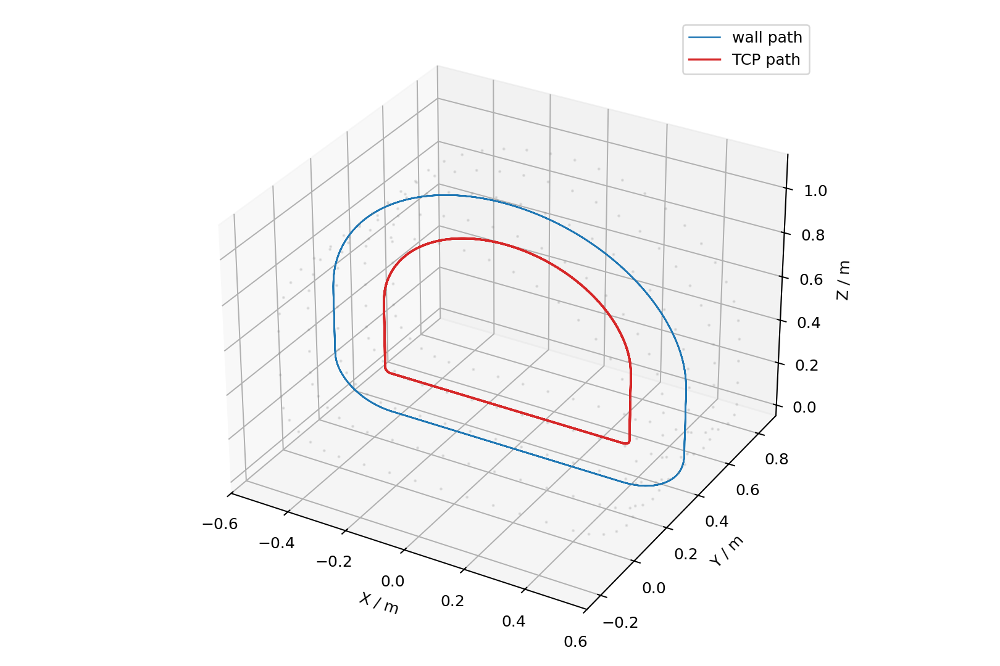
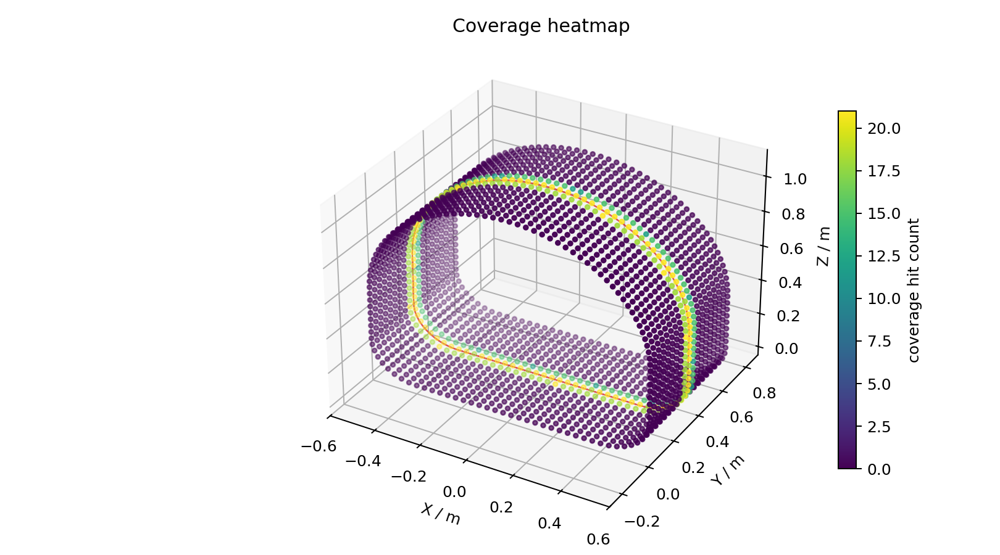
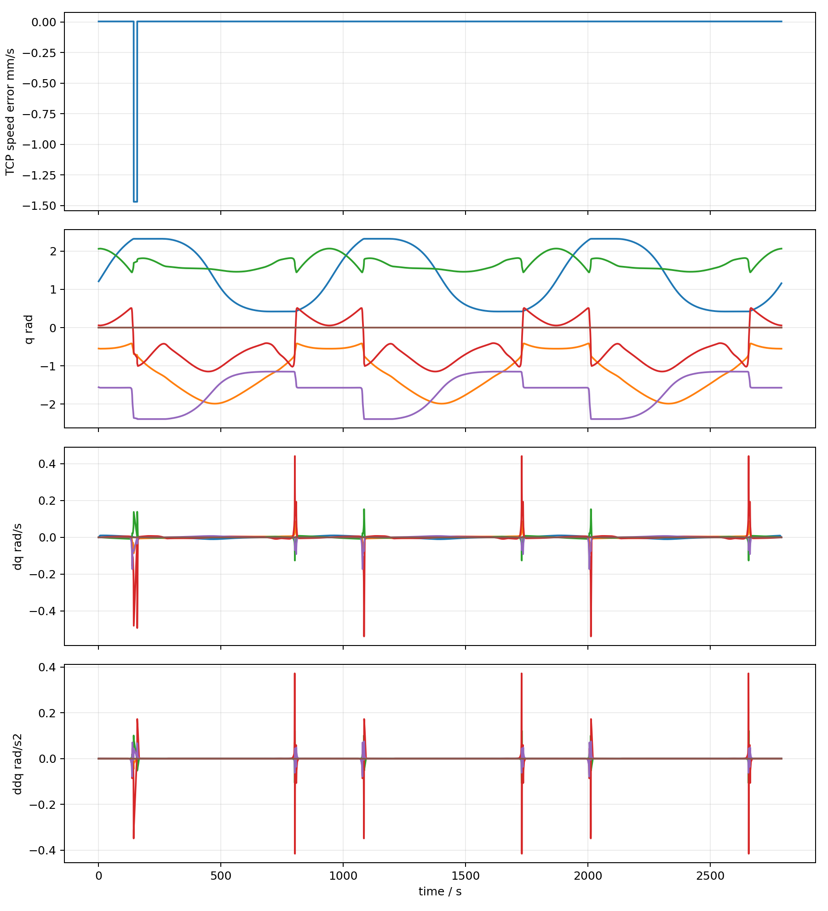

# FR5 Tunnel Closed-Contour Spray Planner


面向 FAIRINO FR5 V6 的隧道内壁闭合马蹄形轮廓喷涂/涂抹轨迹验证项目。它不是只画一条好看的路径，而是从路径生成、TCP 姿态、连续 IK、jerk-limited 时间参数化，一路验证到 ROS2 + MoveIt2 + Ruckig 的生产前质量门。

核心目标是让 FR5 在固定纵向截面 `y = y0` 上重复跟踪同一条闭合轮廓：

```text
left wall -> top arch -> right wall -> bottom closure -> back to start
```

最终严格验证结果来自 MoveIt2 runtime，而不是离线 Python 演示：

```text
overall_status = pass
result_source  = moveit2_strict_runtime
ee_link        = spray_tcp_link
collision      = pass
```

## Highlights

- Closed horseshoe contour generation with wall normals, TCP stand-off, bottom fillets, and multi-loop repeatability.
- Spray and contact tool models with full TCP pose export (`position + quaternion + wall normal`).
- Continuous FR5 IK with explicit tool-axis orientation constraints.
- Ruckig-based jerk-limited timing, plus offline fallback for algorithm demos.
- FK-based quality reports for real TCP speed, stand-off error, normal angle error, and path deviation.
- ROS2 / MoveIt2 bridge using `spray_tcp_link` as the planning tip, native TOTG, native Ruckig smoothing, collision checks, and strict runtime audit scripts.
- Reproducible tests for geometry, timing, FK speed, MoveIt bridge wiring, strict audit behavior, and final report publishing.

## Results Preview

| Path | Coverage | Dynamics |
| --- | --- | --- |
|  |  |  |

More visual outputs are in `outputs/`, including `closed_contour_section.png`, `dynamics_jerk.png`, and `animation_moveit.gif`.

## Repository Layout

```text
src/                         Offline geometry, IK, timing, metrics, and plotting
examples/run_fr5_tunnel_spray.py
                             Main offline simulation entry point
ros2_moveit_bridge/           ROS2 package for MoveIt2 planning and validation
scripts/                      WSL/ROS2 setup and strict validation helpers
tools/                        Audit and final report publishing tools
tests/                        Pytest coverage for planner and bridge behavior
outputs/                      Lightweight example reports and preview images
```

Large generated CSV trajectories, ROS build products, logs, and external vendor mirrors are intentionally ignored by Git.

## Install

```bash
python -m venv .venv
.venv\Scripts\activate
pip install -r requirements.txt
```

Optional packages for higher-fidelity local experiments:

```bash
pip install roboticstoolbox-python spatialmath-python toppra pyvista
```

## Quick Start

Run the default closed-contour spray simulation:

```bash
python examples/run_fr5_tunnel_spray.py --robot-model placeholder --no-animation
```

Run with the official FAIRINO model after preparing vendor assets:

```bash
python examples/run_fr5_tunnel_spray.py --robot-model official --no-animation
```

Typical tuned parameters:

```bash
python examples/run_fr5_tunnel_spray.py ^
  --path-mode closed_horseshoe ^
  --width 1.20 ^
  --height 1.10 ^
  --spray-distance 0.18 ^
  --fillet-radius 0.20 ^
  --loops 3 ^
  --no-animation
```

## Official FR5 Assets

The production-style path expects FAIRINO official ROS2 assets, usually arranged like this:

```text
external/frcobot_ros2/fairino_description/urdf/fairino5_v6.urdf
external/frcobot_ros2/fairino5_v6_moveit2_config/
```

Those external assets are not committed here because they are vendor code and can be large. If they are missing, `--robot-model official` fails loudly instead of silently falling back to a placeholder model.

Use the placeholder model only for algorithm demonstrations:

```bash
python examples/run_fr5_tunnel_spray.py --robot-model placeholder
```

## ROS2 / MoveIt2 Strict Validation

The bridge package in `ros2_moveit_bridge/` does the production-facing validation chain:

1. Adds `spray_tcp_link` as a fixed tool TCP.
2. Uses `spray_tcp_link`, not `wrist3_link`, as the MoveIt planning tip.
3. Reads `outputs/tcp_poses.csv` or `outputs/tcp_poses_base_link.csv`.
4. Validates quaternion-vs-wall-normal alignment.
5. Builds a MoveIt trajectory, applies TOTG, then applies native Ruckig smoothing.
6. Recomputes FK for TCP speed, stand-off, normal angle, path deviation, and joint dynamics.
7. Builds tunnel collision geometry and rejects unsafe execution.
8. Keeps `execute_trajectory:=false` by default.

Example:

```bash
colcon build --packages-select fairino_description fairino5_v6_moveit2_config fr5_tunnel_moveit_bridge
source install/setup.bash

REPO_ROOT=/absolute/path/to/repo \
ROS_WS=/absolute/path/to/ros2_ws \
TOOL_TCP_XYZ="0.000 0.000 0.150" \
bash /absolute/path/to/repo/scripts/run_moveit_strict_validation.sh
```

## Quality Gates

The strict runtime summary in `outputs/final_acceptance_summary.json` records:

```text
max normal error     ~= 2.49 deg
max stand-off error  ~= 1.28 mm
max FK path error    ~= 1.85 mm
TCP speed p05/p95    ~= 3.6e-10 fluctuation
max velocity ratio   ~= 0.168
max acceleration     ~= 0.594
max jerk ratio       ~= 0.187
collision count      = 0
```

These numbers are example validation artifacts for the committed sample outputs. Real deployments must recalibrate the physical tool TCP and rerun the full MoveIt2 chain.

## Test

```bash
python -m pytest -q
python -m compileall src examples ros2_moveit_bridge tests
python ros2_moveit_bridge/validate_bridge_inputs.py --tcp-path-csv outputs/tcp_poses.csv --samples-per-loop 240
python tools/audit_goal_requirements.py --json-report outputs/audit_goal_requirements.json
```

## Safety Notes

This repository is a planning and validation prototype. Before using a real robot, calibrate the spray/contact TCP, verify the controller interface, confirm emergency stop and workspace safeguards, rebuild collision geometry from the actual workcell, and run the strict ROS2 + MoveIt2 validation chain with execution disabled first.

## License

MIT. See [LICENSE](LICENSE).
